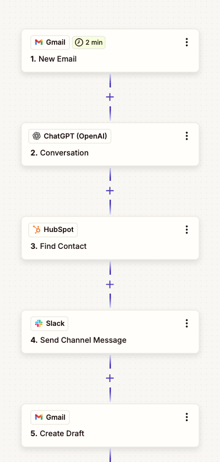

# Automated Client Inbound Processor

### The Problem & Goal

* **Pain Point:** The team spends valuable time on "non-value-add" tasks: manually reading every email, copy-pasting customer info into HubSpot, searching through G-Drive files to find answers, and coordinating in Slack.
* **Client's ask:** Automate the **Triage-to-Reply pipeline**. The goal is to move from "reacting to everything" to "reviewing the AI's best work."

---

### The Zapier Architecture (The "Flow")

| Step | Component | Action |
| :--- | :--- | :--- |
| **Trigger** | Gmail | New Email Matching Search (e.g., in:inbox) |
| **Action 1** | **OpenAI (ChatGPT)** | Prompt: "Analyze this email. Return: Sentiment, Priority, Category, and a 2-sentence draft." |
| **Action 2** | HubSpot | Find or Create Contact. |
| **Action 3** | HubSpot | Create/Update Task or Note on the contact record with the AI's analysis. |
| **Action 4** | Slack | Send Channel Message: "New request from [Name]. Priority: [High]. Draft ready in Gmail." |
| **Action 5** | Gmail | Create Draft (using the text from Action 1). |

---

### Configuration & Setup

#### 1. The Trigger

* **App:** Gmail
* **Event:** New Email
* **Config:** Set a specific label (e.g., "AI-Process") in Gmail. Only trigger when a new email arrives with that label. This prevents the Zap from processing your entire inbox.

#### 2. The Intelligence (OpenAI Integration)

* **App:** OpenAI
* **Event:** Conversation or Assistant
* **Prompt Engineering:**
> "You are a professional assistant. Analyze the following email: {{Email Body}}.
> 1. Determine if this is a Support, Sales, or General request.
> 2. Determine urgency (High/Medium/Low).
> 3. Write a professional, empathetic response draft.
> Output as JSON."
> 
> 

#### 3. The Logic (HubSpot & Slack)

* **HubSpot:** Use the "Find Contact" action. If it doesn't exist, use "Create Contact." Update the "Recent Interaction" property with the email summary provided by OpenAI.
* **Slack:** Format the message clearly: `*New Lead/Support Alert* \n User: {{Sender Name}} \n Priority: {{Priority}} \n Link: [Link to Gmail Draft]`.

---

### Testing & Troubleshooting

#### How to Test:

* **Step-by-Step:** Do not turn the Zap on yet. Use the "Test Step" feature in each node. Verify that the OpenAI prompt actually returns the JSON you expect.
* **Draft Verification:** Ensure your HubSpot ID and Gmail Account are correctly mapped so that the Draft ends up in the correct account.

#### Common Troubleshooting:

* **Hallucination:** If the AI is too creative, add a constraint to the prompt: *"Only use the provided tone guidelines. Do not invent pricing or services."*
* **Looping:** If the Zap triggers on its own replies, ensure the Gmail filter specifically excludes emails where the "From" address is your company domain.
* **Data Formatting:** If HubSpot fails to update, ensure the "Email" field is properly mapped. Use a "Formatter by Zapier" step if you need to extract the email address from a long header string.

---

### Client Recommendation

Since you want **human approval**:
Instead of sending an email, use the **"Create Draft"** action in Gmail. The final "human step" is the team member opening the Gmail draft, verifying it, and hitting "Send." This keeps you in control while the AI does 90% of the drafting work.
