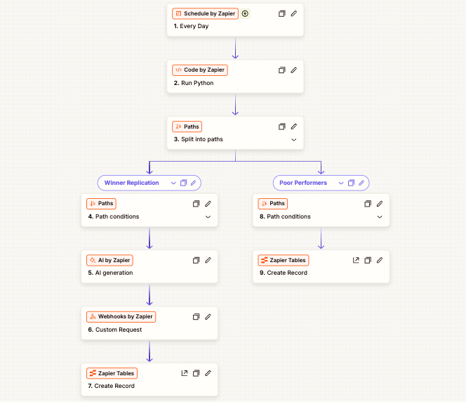

This automation is a high-performance **Creative Hook Optimization Engine**. It automatically monitors your Meta Ad performance, identifies top and bottom-performing creative hooks, and autonomously triggers a generative AI pipeline to create new video assets based on winning data.


---

## 1. Setup & Configuration Guide

### Step 1: Schedule by Zapier

* **Event:** "Every Day."
* **Configuration:** Set to your preferred time (e.g., 1:00 AM) to ensure the previous day's full data set is analyzed.

### Step 2: Code by Zapier (Python)

* **Action:** Run Python.
* **Goal:** Connect to Meta Graph API to pull ad insights.
* **Logic:** The code iterates through your active ads, extracts ROAS (Return on Ad Spend) data for purchases, and identifies the `highest_roas` hook and `lowest_roas` underperformers.

### Step 3: Paths (Branching)

* **Logic:** Split the workflow into two branches:
* **Path A (Winner Replication):** Continues if `roas_score` >= 3.0.
* **Path B (Poor Performers):** Continues if `roas_score` < 1.5.


### Step 4 (Path A): AI by Zapier (Generative)

* **Action:** Get Completion (Advanced/Auto).
* **Instructions:** Provide the `top_performing_hook` from Step 2. Instruct the AI to generate 3 highly visual, alternative scene descriptions for video generation tools (Kling/Seedance/Wan2.1).

### Step 5 (Path A): Webhooks by Zapier

* **Action:** POST request.
* **Endpoint:** Connect to your preferred Video AI API (e.g., Hugging Face Wan2.1 or RunwayML).
* **Payload:** Pass the scene descriptions generated in Step 4.

### Step 6 (Path A): Zapier Tables

* **Action:** Create Record.
* **Data:** Store the original Ad ID, the new AI-generated scene descriptions, and a status of "Pending Generation."

### Step 7 (Path B): Zapier Tables

* **Action:** Create Record.
* **Data:** Log the underperforming Ad ID and mark it as "Flagged for Manual Pause" for your media buyer.

---

## 2. Technical Implementation: Code (Step 2)

```python
import requests

# 1. AUTHENTICATION
ACCESS_TOKEN = "YOUR_ACCESS_TOKEN"
AD_ACCOUNT_ID = "act_YOUR_ID"

# 2. META GRAPH API CALL
url = f"https://graph.facebook.com/v20.0/{AD_ACCOUNT_ID}/ads"
params = {'access_token': ACCESS_TOKEN, 'fields': 'name,creative{body},insights{roas}'}

response = requests.get(url, params=params).json()

# 3. LOGIC TO IDENTIFY WINNERS/LOSERS
ads = response.get('data', [])
highest_roas = 0.0
top_hook = ""

for ad in ads:
    # Logic to parse ROAS from insights
    roas = float(ad.get('insights', {}).get('data', [{}])[0].get('roas', 0))
    if roas > highest_roas:
        highest_roas = roas
        top_hook = ad.get('creative', {}).get('body', "")

output = {"top_performing_hook": top_hook, "roas_score": highest_roas}

```

---

## 3. Test Results & Expectations

| Step | Expected Result | Success Indicator |
| --- | --- | --- |
| **Code (Step 2)** | JSON Payload | `top_performing_hook` text and `roas_score` number returned. |
| **Path A (Winner)** | AI Generation | 3 distinct visual scenes in `output` field. |
| **Path B (Loser)** | Table Row | Record created in Zapier Tables with "Flagged" status. |
| **Webhook** | API Response | HTTP 200/202 from Video AI provider. |

### Common Debugging Tips:

* **API Limits:** Ensure your Meta Access Token has `ads_read` permissions.
* **ROAS Parsing:** The structure of Facebook's `insights` array can change; always check if `action_values` contains `purchase` before setting your score.
* **Table Setup:** Ensure your Zapier Table has columns mapped specifically for `Ad ID`, `Hook`, and `Status` to allow easy filtering by your team.

