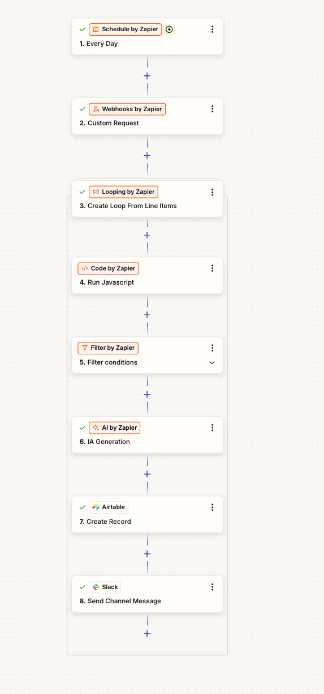

# Autonomous AI Ad Creative Pipeline (Creative Hook Optimization Engine)

A high-performance automated auditing and generative creative production pipeline built to eliminate manual ad account management, trace critical budget leaks, and instantly deliver high-impact direct-response script hooks to media buyers.

## 1. Problem Statement
Most performance growth marketing teams burn thousands of dollars on video creatives without realizing their primary point of customer drop-off happens within the first 3 seconds of playtime. If a viewer scrolls past a video instantly, the subsequent structural hooks, value propositions, and closing call-to-actions contained within the script become completely irrelevant. 

Manually auditing asset-level retention velocity across dozens of active ad accounts is highly inefficient, prone to human error, and acts reactively rather than preventatively—frequently flagging budget leaks only after substantial financial capital has already been wasted.

## 2. Core Concept & Formula
The architecture introduces an automated, high-frequency auditing and creative synthesis infrastructure. Operating via a programmatic daily schedule, the system captures real-time data arrays from active advertising platforms, flattens multi-layered performance payloads using isolated sandboxed runtime environments, filters out stable configurations to minimize computing load, and deploys Large Language Models (LLMs) to automatically synthesize alternative creative hook scripts for underperforming assets.

The runtime engine evaluates creative performance using the following core formula:

$$Hook\ Retention\ Rate = \left(\frac{3\text{-Second Video Views}}{\text{Total Video Plays}}\right) \times 100$$

## 3. End-to-End Operational SIPOC Profile
* **Suppliers:** Advertising Platform Graph Marketing API Engines.
* **Inputs:** Programmatic Access Tokens & System-Level Metric Arrays (`ad_id`, `ad_name`, `spend`, `inline_link_click_ctr`, and `video_play_actions`).
* **Process:** Scheduled batch ingestion $\rightarrow$ line-item array loops $\rightarrow$ custom JavaScript metric parsing $\rightarrow$ high-pass filter gating $\rightarrow$ Generative AI script synthesis.
* **Outputs:** Normalized performance metrics (`hookRate`), automated optimization status flags, and 3 distinct pattern-interrupt script variations.
* **Customers:** Downstream database repositories (Airtable Tracking Engine) and real-time communication networks (Slack Channels).

---


## 4. Automation Step Blueprint

### Step 1: Temporal Initialization (Schedule by Zapier)
* **Module:** Schedule by Zapier
* **Trigger Configuration:** Execute daily at exactly **1:00 AM**. This ensures all performance analytics from the previous complete calendar day are fully consolidated by the network before running the pipeline.

### Step 2: Automated Data Extraction (Webhooks by Zapier)
* **Module:** Webhooks by Zapier (Custom Request)
* **Method:** `GET`
* **Target Endpoint Configuration (Anonymized Platform Template):**
    ```text
    [https://graph.platform.com/v20.0/act_YOUR_ACCOUNT_ID_PLACEHOLDER/insights?level=ad&date_preset=today&fields=ad_id,ad_name,spend,inline_link_click_ctr,video_play_actions](https://graph.platform.com/v20.0/act_YOUR_ACCOUNT_ID_PLACEHOLDER/insights?level=ad&date_preset=today&fields=ad_id,ad_name,spend,inline_link_click_ctr,video_play_actions)
    ```

### Step 3: Ingestion Array Serialization (Looping by Zapier)
* **Module:** Looping by Zapier (Loop From Line Items)
* **Loop Length Configuration:** Map the parent array identification token (`2. Data`) into the *Values to Loop* field **exactly once** to govern the complete cycle iteration count.
* **Key-Value Mapping Grid:**
    * `ad_id` $\rightarrow$ `2. Data: ad_id`
    * `ad_name` $\rightarrow$ `2. Data: ad_name`
    * `spend` $\rightarrow$ `2. Data: spend`
    * `ctr` $\rightarrow$ `2. Data: ctr`
    * `video_plays` $\rightarrow$ `2. Data: video_plays`

### Step 4: Computation & Metrics Parsing (Code by Zapier)
* **Module:** Code by Zapier (Nested within loop)
* **Execution Environment:** Run JavaScript
* **Input Data Mappings:** * `videoPlaysRaw` $\rightarrow$ `3. video_plays`
    * `spend` $\rightarrow$ `3. spend`
    * `ctr` $\rightarrow$ `3. ctr`
* **Code Script:** Save the core parsing rules found in `index.js`.

### Step 5: High-Pass Allocation Filter (Filter by Zapier)
* **Module:** Filter by Zapier (Nested within loop)
* **Rule Logic:** Continue only if `4. needsOptimization` *(Boolean)* matches `true`. This immediately terminates workflows for efficient ad variants, preventing runtime creep and keeping API token overhead perfectly lean.

### Step 6: Generative Script Synthesis (AI by Zapier)
* **Module:** AI by Zapier (IA Generation - Advanced Auto Model)
* **Prompt Configuration Framework:**
    ```text
    You are an expert direct-response copywriter specializing in video ad creatives.
    An active ad asset has triggered a performance alert because its 3-second hook rate has dropped below the 30% viability threshold.

    [AD DETAILS]
    - Ad Name: {{3. ad_name}}
    - Current Spend Today: ${{4. spend}}
    - Outbound CTR: {{4. ctr}}%
    - Hook Retention Rate: {{4. hookRate}}%

    [OBJECTIVE]
    Analyze the current metrics and generate 3 alternative, high-impact hook variations (the first 3 seconds of the video script) designed to arrest scrolling attention and dramatically lift the hook retention rate. Focus heavily on pattern-interrupt frameworks, curiosity gaps, or strong problem-centric callouts. Return ONLY the 3 script variants.
    ```

### Step 7: Relational Data Warehousing (Airtable Database Layer)
* **Module:** Airtable (Create Record inside Loop)
* **Data Model Ingestion Map:** * `Ad ID` $\rightarrow$ `{{3. ad_id}}`
    * `Ad Name` $\rightarrow$ `{{3. ad_name}}`
    * `Hook Rate` $\rightarrow$ `{{4. hookRate}}%`
    * `Spend Today` $\rightarrow$ `{{4. spend}}`
    * `Outbound CTR` $\rightarrow$ `{{4. ctr}}`
    * `AI Suggested Hooks` $\rightarrow$ `{{6. Output}}`

### Step 8: Incident Alert Dissemination (Slack Channel Pipeline)
* **Module:** Slack (Send Channel Message inside Loop)
* **Deployment Markdown Output:**
    ```text
    🚨 *CREATIVE HOOK UNDERPERFORMANCE ALERT* 🚨

    The creative asset *{{3. ad_name}}* (`{{3. ad_id}}`) has broken optimization bounds.

    📊 *Current Performance (Today):*
    • *Spend:* ${{4. spend}}
    • *Outbound CTR:* {{4. ctr}}%
    • *3-Second Hook Rate:* `{{4. hookRate}}%` *(Threshold: <30%)*

    💡 *AI-Generated Hook Overhauls (Pattern Interrupts):*
    {{6. Output}}

    cc: @Marketing Team Please deploy these alternative copy angles for an immediate asset swap!
    ```

---
🌐 **Enterprise Operations & Engineering Consultation:** Architected by **CX Insights PH** (Solution Partnerships & Workflow Automation Automation). 
Connect directly via [LinkedIn Profile](https://www.linkedin.com/in/cxinsightsph/).