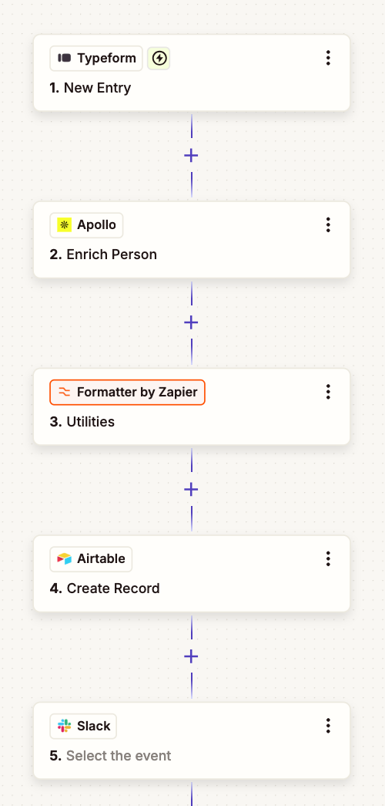

# The "Instant Sales Alert" (Priority Leads)

* **Goal** : Immediate enrichment and notification for high-intent traffic.

This automation is a high-impact workflow for Sales Development Representatives (SDRs). By enriching leads in real-time, you ensure that your sales team isn't just chasing leads, but chasing the *right* leads.


---

## 1. Setup & Configuration Guide

### Step 1: Trigger (Typeform/Webflow)

* **Event:** "New Entry" or "New Form Submission."
* **Requirement:** Ensure your form captures the **Email Address** as a required field. Apollo.io relies heavily on email to map data accurately.

### Step 2: Apollo.io (Enrichment)

* **Event:** "Enrich Person."
* **Mapping:** Map the `Email` field from your Trigger to the `Email` field in Apollo.
* **Outcome:** Apollo will return a structured JSON object. You will use the following fields for subsequent steps:
* `Organization Name`
* `Organization Employees` (This is crucial for the scoring step)
* `Industry`


### Step 3: Zapier Formatter (Scoring Logic)

* **Event:** "Utilities" > "Lookup Table."
* **Setup:**
* **Lookup Key:** Map the `Organization Employees` field from Apollo.
* **Lookup Table:** This is where you define your "Priority" logic.
* *Tip:* Since company size can be a range (e.g., "51-200"), ensure your logic covers the tiers you care about.


* **Alternative:** If you prefer simple logic, use a **Formatter "Number" or "Text"** step with the **"Spreadsheet-style Formula"** option:
* `IF(A > 50, "High", "Standard")` (where A is the employee count).


### Step 4: Airtable (Database)

* **Action:** "Create Record."
* **Mapping:** * Map the original form fields (Name, Email, Phone).
* Map the enriched fields from Apollo (Company, Industry, Size).
* Map the **Score** result from your Formatter step.


* **Field Type:** Set the "Score" field in Airtable as a **Single Select** to keep your data clean.

### Step 5: Slack (Notification)

* **Action:** "Send Channel Message."
* **Message Template:**
> 🚨 **New High-Intent Lead!**
> 👤 **Name:** {{Name}}
> 🏢 **Company:** {{Company}}
> 📊 **Score:** {{Score}}
> 🔗 [View Lead in Airtable](https://www.google.com/search?q=%7B%7BAirtable_Record_URL%7D%7D)


---

## 2. Technical Implementation: Custom Code (Optional)

If you find the Formatter or standard steps too limiting (e.g., if you want to score based on both *Company Size* AND *Industry*), use a **Code by Zapier** (JavaScript) step between Apollo and Airtable.

**Code Template:**

```javascript
// Input data comes from the previous steps
const employees = parseInt(inputData.employees) || 0;
const industry = inputData.industry;

let score = "Standard";

// Advanced Logic: High intent if large co OR specific industry
if (employees > 50 || industry === "Software") {
  score = "High";
}

output = { score: score };

```

* **Setup:** Map `employees` and `industry` from the Apollo step to the `inputData` section of the code block.

---

## 3. Test Results & Expectations

When running your test, look for these specific outputs:

| Field | Expected Data Type | Example Test Value |
| **Apollo Data** | String/Number | "Acme Corp", "150", "Tech" |
| **Formatter/Code** | String | "High" |
| **Airtable** | Record Created | [Link to Record] |
| **Slack** | Message Sent | 🚨 New High-Intent Lead... |

### Common Debugging Tips:

1. **Apollo Credits:** Ensure your Apollo account has sufficient credits; otherwise, the step will fail silently or return "Null."
2. **Mapping Errors:** Always use the "Test" button at each individual step rather than testing the whole Zap at once. This isolates which step is failing (usually the data mapping from Apollo).
3. **Airtable Triggers:** If your sales team needs to work *out* of Airtable, ensure you have an "Status" field (e.g., New, Contacted, Qualified) so they can track the lead status.

---

